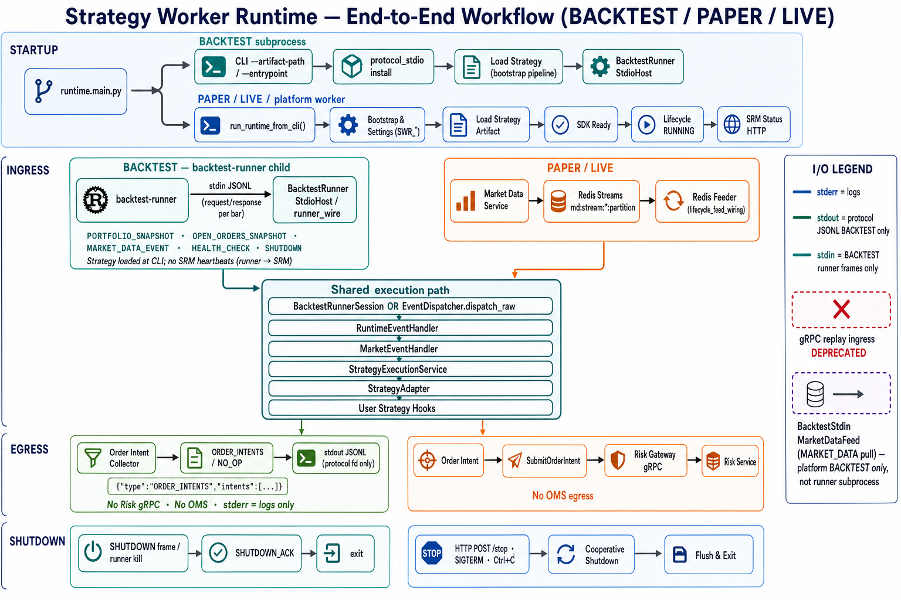
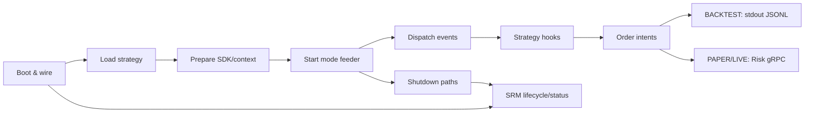
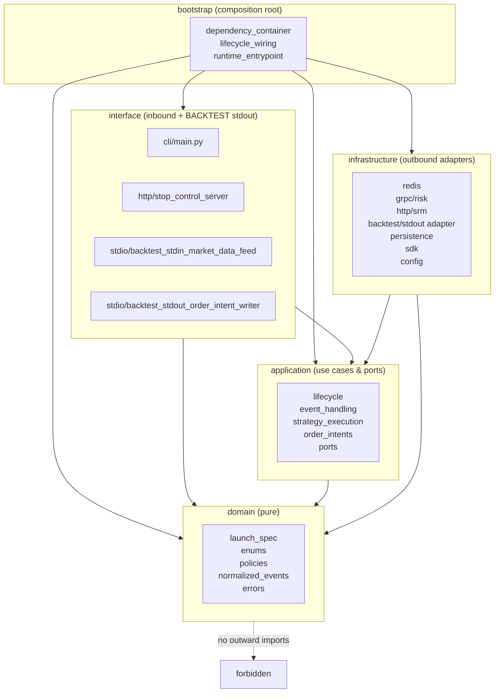
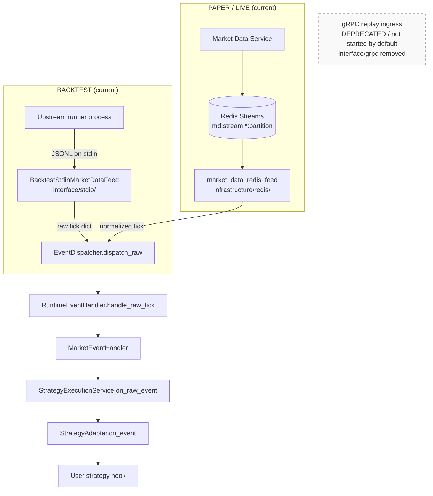
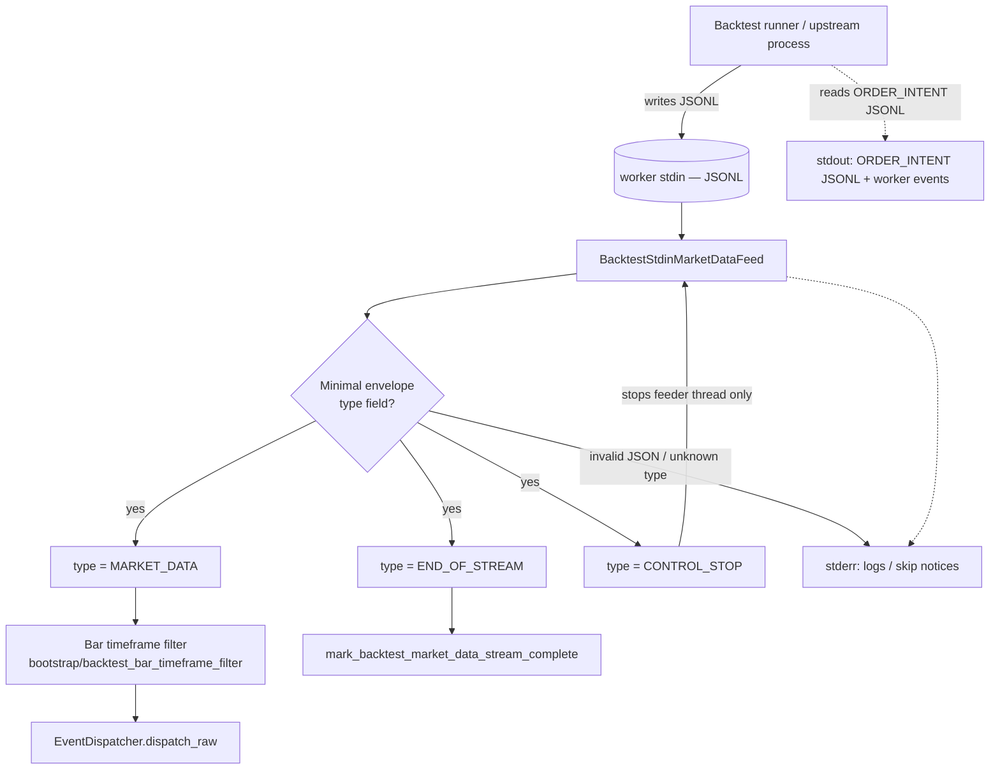
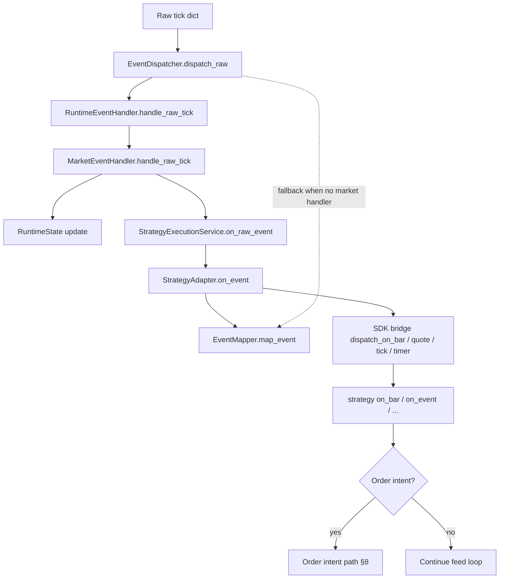
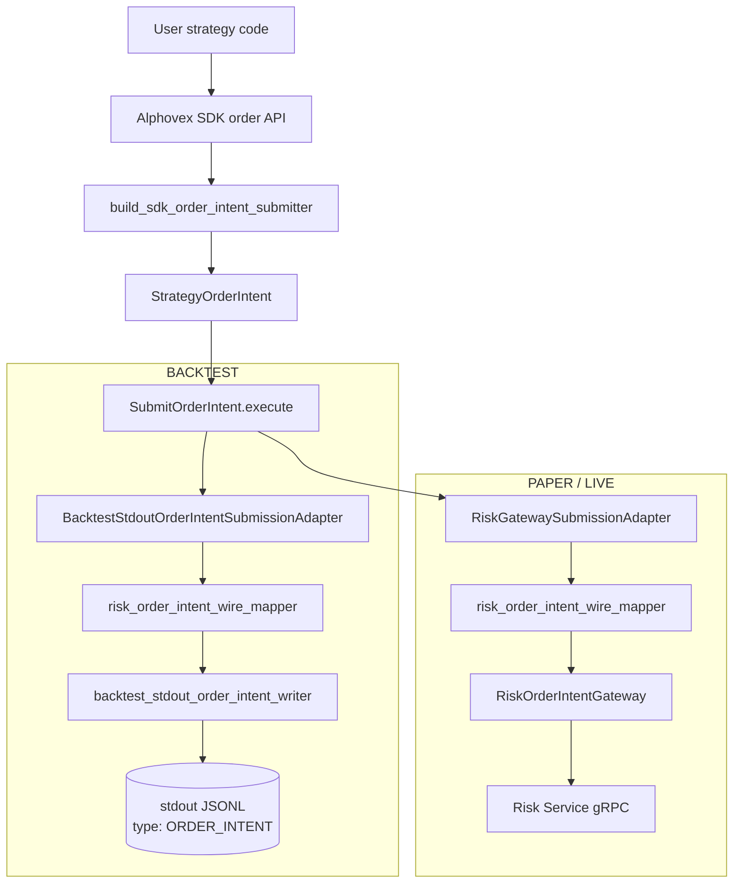
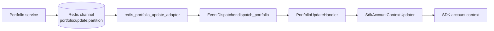
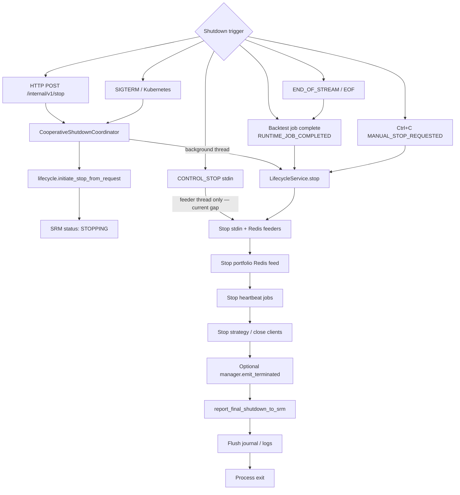

# Strategy Worker Runtime — Workflow

This document describes the **current** runtime workflow of **strategy-worker-runtime** (SWR): a Python process that loads a user strategy artifact, receives market data, dispatches events, runs strategy hooks, emits order intents (BACKTEST stdout JSONL; PAPER/LIVE Risk Service gRPC), and reports lifecycle/status to Strategy Runtime Manager (SRM).

Where **current** behavior differs from the **target** architecture direction, both are labeled explicitly.

Related: [strategy_worker_runtime_ddd_refactor.md](./strategy_worker_runtime_ddd_refactor.md) (layer boundaries and refactor notes).



The diagram above shows **three operational shapes** in one runtime package:

| Path | Entry | Market data ingress | Order egress | SRM |
|------|--------|---------------------|--------------|-----|
| **BACKTEST subprocess** | `main.py` + `--artifact-path` / `--entrypoint` → `BacktestRunnerStdioHost` | **backtest-runner** stdin JSONL (`PORTFOLIO_SNAPSHOT`, `MARKET_DATA_EVENT`, …) | stdout `ORDER_INTENTS` / `NO_OP` (protocol fd) | **No** — runner owns heartbeats |
| **PAPER / LIVE** | `run_runtime_from_cli()` full bootstrap | Redis Streams (`md:stream:*`) | Risk Service gRPC | HTTP lifecycle + status |
| **Platform BACKTEST** (optional) | Same as PAPER/LIVE with `SWR_MODE=BACKTEST` | `BacktestStdinMarketDataFeed` (`MARKET_DATA` pull) | stdout `ORDER_INTENT` push | Per lifecycle config |

Sections below describe **current code** in more detail; where they differ from the subprocess row, treat the diagram as the **target** backtest-runner integration.

---

## 1. Overview

In simple terms, strategy-worker-runtime:

1. **Boots the runtime** — validates minimal process environment, loads settings, wires the composition root.
2. **Loads the strategy artifact** — fetch, verify, entrypoint load, SDK contract validation.
3. **Prepares SDK/context** — builds the SDK bridge, binds strategy instance, runs `initialize` / `on_start`.
4. **Receives market data** — mode-specific feeders (BACKTEST stdin JSONL; PAPER/LIVE Redis streams).
5. **Dispatches events** — all ingress paths converge on `EventDispatcher.dispatch_raw(...)`.
6. **Runs strategy hooks** — `StrategyExecutionService` → `StrategyAdapter` → user strategy code.
7. **Emits order intents** — BACKTEST writes `ORDER_INTENT` JSONL to stdout; PAPER/LIVE submit to Risk Service via gRPC (no OMS).
8. **Reports lifecycle/status to SRM** — HTTP lifecycle signals and periodic status heartbeats.
9. **Handles shutdown** — cooperative stop (HTTP, SIGTERM, backtest stream end, Ctrl+C).



**Process I/O conventions**

| Stream | Purpose |
|--------|---------|
| **stderr** | Human-readable logs and diagnostic notes |
| **stdout** | Machine-readable JSONL — BACKTEST `ORDER_INTENT` lines, worker status envelopes |
| **stdin** | BACKTEST market-data ingress only (JSON lines from upstream runner) |

---

## 2. Layered architecture

SWR follows DDD / hexagonal layering under `runtime/`:

```
runtime/
  domain/           # Pure models, specs, events, policies, errors
  application/      # Use cases, orchestration, ports
  interface/        # Inbound adapters (CLI, HTTP stop, BACKTEST stdin) + BACKTEST stdout JSONL writer
  infrastructure/   # Outbound adapters (Redis, Risk gRPC, SRM HTTP, SQLite, SDK, BACKTEST stdout adapter, config)
  bootstrap/        # Composition root — wires all layers
```

### Dependency direction



### Layer rules (enforced in CI)

| Layer | Depends on | Must **not** import |
|-------|------------|---------------------|
| **domain** | (stdlib only) | `application`, `interface`, `infrastructure`, `bootstrap` |
| **application** | `domain`, ports | `infrastructure`, `interface`, `bootstrap` |
| **interface** | `application`, `domain` | `infrastructure` (construct adapters in bootstrap) |
| **infrastructure** | `application` ports, `domain` | `bootstrap` |
| **bootstrap** | all layers | — (composition root) |

**Key points**

- **bootstrap** is the only place that constructs concrete adapters and injects them into use cases.
- **interface** is protocol-only for inbound concerns; it must not reach into Redis/gRPC/SQLite directly.
- **application/domain** do **not** read `sys.stdin` or write order intents to `sys.stdout` directly — stdio adapters live under `interface/stdio/` and are wired from bootstrap.
- Market-data orchestration currently lives primarily in `bootstrap/lifecycle_feed_wiring.py` and `infrastructure/redis/` (not yet extracted to `application/market_data/`).

---

## 3. Startup workflow

Entry: `runtime/main.py` → `runtime/interface/cli/main.py` → `run_runtime_from_cli()`.

```mermaid
sequenceDiagram
  participant Main as main.py / cli/main.py
  participant Entry as bootstrap/runtime_entrypoint
  participant Env as minimal_env_validation
  participant SRM as SRM HTTP status
  participant Settings as infrastructure/config/settings
  participant Comp as bootstrap/runtime_composition
  participant DI as bootstrap/dependency_container
  participant LC as LifecycleService
  participant Host as lifecycle_host_wiring
  participant Feed as lifecycle_feed_wiring
  participant WA as WorkerApp

  Main->>Entry: run_runtime_from_cli()
  Entry->>Env: validate_minimal_env_from_environ()
  Env-->>Entry: RUNTIME_ID, SRM base URL snapshot
  Entry->>SRM: report_minimal_env_validation_to_srm()
  alt minimal env invalid
    Entry-->>Main: SystemExit(2)
  end
  Entry->>Settings: load_settings() → LaunchSpec + Settings
  Note over Settings: build runtime identity / trace / artifact specs
  Entry->>Comp: build_runtime_outbound_clients()
  Note over Comp: SRM HTTP client; Risk gRPC client (PAPER/LIVE only; ignored in BACKTEST)
  Entry->>DI: build_runtime_container()
  Note over DI: configure logging, journal, lifecycle, worker_app
  Entry->>Entry: CooperativeShutdownCoordinator + SIGTERM handler
  opt worker_control_http_bind set
    Entry->>Entry: StopControlHttpServer POST /internal/v1/stop
  end
  Entry->>WA: worker_app.run() → lifecycle.run()
  WA->>LC: start() bootstrap pipeline
  LC->>LC: validate launch metadata
  LC->>LC: resolve artifact + SDK validate
  LC->>LC: initialize runtime dependencies (clock; Risk gateway if PAPER/LIVE)
  LC->>LC: strategy_adapter.bind_and_start()
  LC->>SRM: bootstrap_succeeded signal + status
  LC->>LC: phase READY → RUNNING
  LC->>Host: attach LifecycleHostPorts
  Host->>Feed: start mode-specific market-data feeder
  Feed-->>LC: runtime RUNNING, consuming ticks
```

### Bootstrap (step reference)

| Phase | What happens | Primary modules |
|-------|--------------|-----------------|
| Pre-bootstrap | Minimal env validation (`RUNTIME_ID`, SRM URL from process env) | `bootstrap/minimal_env_validation.py` |
| SRM pre-report | POST runtime status for env validation outcome | `bootstrap/srm_env_status_report.py` |
| Settings | Load bundle / SDS runtime-context / `strategy_bundle/setting.json` → `LaunchSpec` | `infrastructure/config/settings.py`, `domain/launch_spec.py` |
| Specs | Artifact, calculation, channels, identity, trace specs | `bootstrap/runtime_spec_builder.py` |
| Logging | `configure_logging()` + runtime context bind (stderr) | `infrastructure/config/logging.py`, `infrastructure/observability/logger.py` |
| Journal | Optional SQLite + text sink | `infrastructure/persistence/runtime_journal_sink.py` |
| Bootstrap pipeline | Fetch → verify → entrypoint load → SDK validate | `bootstrap/dependency_container.py`, `infrastructure/strategy_loader/` |
| Lifecycle start | Strategy bind/start, bootstrap-ready signal | `application/lifecycle/lifecycle_service.py` |
| DDD wiring | EventDispatcher, strategy execution, heartbeat | `bootstrap/lifecycle_wiring.py` |
| Feed start | BACKTEST stdin or PAPER/LIVE Redis | `bootstrap/lifecycle_feed_wiring.py` |

After `lifecycle.run()` succeeds, `WorkerApp` enters a post-start wait loop and may emit `worker.state.waiting_for_manager` on stdout until an external stop or backtest job completion triggers shutdown (**current** behavior).

---

## 4. Mode-specific market-data ingress

All modes converge into the same strategy execution path after normalization. Strategy code does **not** know whether ticks came from stdin or Redis.



### Feeder selection (`bootstrap/lifecycle_feed_wiring.py`)

| Mode | Feeder | Started when |
|------|--------|--------------|
| **BACKTEST** | `BacktestStdinMarketDataFeed` | `WorkerMode.BACKTEST` |
| **PAPER / LIVE** | `run_market_data_redis_loop` | `WorkerMode.PAPER` or `LIVE` and Redis URL configured |
| **Other** | none | Worker idles |

**Deprecated / disabled:** gRPC replay ingress is **not** an active BACKTEST path. `runtime/interface/grpc/` and `runtime/interface/worker_protocol/` have been removed. `runtime/infrastructure/grpc/replay/` is an empty stub package — not wired at startup.

---

## 5. BACKTEST stdin workflow

BACKTEST market data is delivered by an **upstream runner/controller** process that writes JSON lines to the worker's stdin. strategy-worker-runtime does **not** depend on any external "backtest service" concept; it only reads stdin.



### Stdin message types (skeleton — contract pending)

Defined in `runtime/interface/stdio/stdin_protocol.py`:

| `type` value | Current behavior |
|--------------|------------------|
| `MARKET_DATA` | Extract payload (`payload`, `data`, or non-`type` fields) → dispatch tick |
| `END_OF_STREAM` | Mark backtest stream complete; feeder exits |
| `CONTROL_STOP` | Stop stdin read loop (**does not** currently call full lifecycle stop) |
| *(EOF)* | Treated like end-of-stream |

**Payload contract is intentionally pending.** Do not assume a final schema for tick fields; normalization happens downstream in the event/strategy path.

**Not supported:** `OPEN_ORDERS_SNAPSHOT` and any other stdin types outside the allowed skeleton set are rejected with a stderr notice.

---

## 6. PAPER / LIVE Redis workflow

PAPER and LIVE modes consume market data from **Redis Streams** (not Pub/Sub `md:realtime:*`).

```mermaid
flowchart LR
  MDS[Market Data Service]
  RS[(Redis Streams<br/>md:stream:bars\|quotes\|trades:partition)]
  LOOP[run_market_data_redis_loop]
  SYM[Filter by parameters.symbol]
  NORM[Stream payload → raw tick dict]
  DISP[EventDispatcher.dispatch_raw]
  HOOK[Strategy hook]

  MDS --> RS
  RS -->|XREAD / XREADGROUP| LOOP
  LOOP --> SYM --> NORM --> DISP --> HOOK
```

| Item | Detail |
|------|--------|
| Transport | Redis **Streams** (`XREAD` / `XREADGROUP`) |
| Key pattern | `md:stream:{feed}:{partition}` |
| Partition | Derived from `parameters.symbol` via `market_data_partition()` |
| Config | `market_data_redis_url`, `market_data_feeds`, consumer group flags |
| Callback | `LifecycleService._dispatch_paper_live_tick` → `EventDispatcher.dispatch_raw` |

If Redis is not configured, PAPER/LIVE workers log to stderr and idle until shutdown.

---

## 7. Strategy execution workflow

Mode-agnostic path from raw tick to user strategy code:



| Component | Path |
|-----------|------|
| Wiring | `bootstrap/lifecycle_wiring.py` → `build_lifecycle_ddd_wiring` |
| Runtime handler | `application/event_handling/runtime_event_handler.py` |
| Market handler | `application/event_handling/market_event_handler.py` |
| Execution service | `application/strategy_execution/strategy_execution_service.py` |
| Adapter | `application/strategy_execution/strategy_adapter.py` |
| SDK bridge | `infrastructure/sdk/runtime_sdk_bridge.py` |

PAPER/LIVE may also emit `signal_generated` domain events from the market handler; portfolio updates (§9) update SDK account context but **do not** invoke strategy hooks.

---

## 8. Order intent workflow

Order intent egress is **mode-specific**. There is **no OMS client** and **no OMS egress** in strategy-worker-runtime.

| Mode | Egress target | Transport |
|------|---------------|-----------|
| **BACKTEST** | Upstream runner (via stdout) | JSONL `ORDER_INTENT` envelope |
| **PAPER / LIVE** | Risk Service | gRPC (`risk_worker.proto`) |

Shared path through the application use case; bootstrap selects the infrastructure adapter by mode.



### BACKTEST stdout JSONL format (**current**)

Defined in `runtime/interface/stdio/stdout_protocol.py`. One line per order intent:

```json
{"type":"ORDER_INTENT","payload":{"instrument_id":"AAPL","side":"BUY","quantity":"1","correlation_id":"...",...}}
```

- `payload` fields match the normalized Risk wire shape (`order_intent_wire_dict_for_console`) — same enrichment path as PAPER/LIVE.
- SDK receives `{"accepted": true, "egress": "stdout_jsonl"}` on success.
- Journal callback source is `"backtest"` (not `"risk"`).
- **No Risk gRPC** is invoked in BACKTEST; any supplied Risk client is ignored at dependency wiring.

### PAPER/LIVE Risk gRPC path (**current**)


### Error handling (stable reason codes)

| Condition | Behavior |
|-----------|----------|
| Missing `correlation_id` after wire enrichment | **Fail closed** with `MISSING_CORRELATION_ID` (all modes) |
| Risk rejection (`accepted: false`) | PAPER/LIVE only — stable `reason_code`; default `RISK_ORDER_INTENT_REJECTED` |
| Risk transport / submission failure | PAPER/LIVE only — `OrderIntentSubmissionError` → stable `reason_code` + `error_code` |
| Unexpected internal exception | `ORDER_INTENT_SUBMISSION_INTERNAL_ERROR` — raw exception text is **not** exposed as `reason_code` |
| Risk gRPC target unset | PAPER/LIVE — noop client returns `BOUND_DEPENDENCY_UNAVAILABLE` |
| Wire mapping failure | All modes — `order_intent_wire_mapping_failed`; intent is **not** written to stdout |

Correlation ID resolution order (infrastructure): launch spec / trace spec → runtime fallback env → fail closed if still empty.

Composition: `bootstrap/sdk_order_intent_wiring.py` (from `lifecycle_host_adapters.SdkBridgeFactoryAdapter`).

Mode policy: BACKTEST routes to `ServiceTarget.BACKTEST_RUNNER` with capability `BACKTEST_ORDER_INTENT_EGRESS`; PAPER/LIVE route to `ServiceTarget.RISK_SERVICE` with `RISK_ORDER_INTENT_EGRESS`.

Journal: optional `state_journal.record_order_intent` callback on submit (source `"backtest"` or `"risk"`).

---

## 9. Portfolio / context update workflow

**Current (PAPER/LIVE only):** portfolio balance updates arrive via Redis Pub/Sub, not stdin.



| Item | Detail |
|------|--------|
| Wiring | `bootstrap/lifecycle_feed_wiring.py` |
| Partition | `portfolio_update_partition(job_id)` |
| Handler | `application/event_handling/portfolio_update_handler.py` |
| Port | `application/runtime_state/account_context_updater.py` |
| Strategy hooks | **Not invoked** on portfolio updates (by design) |

**Not supported:** `OPEN_ORDERS_SNAPSHOT` — no stdin or Redis path delivers open-order snapshots to the worker.

**TODO:** Finalize portfolio/context stdin message contract after runner–worker protocol is decided (BACKTEST portfolio ingress via stdin is not implemented today).

---

## 10. Shutdown workflow



| Trigger | Current behavior |
|---------|------------------|
| **HTTP stop** | `CooperativeShutdownCoordinator.request_http_stop` → SRM STOPPING → background `worker_app.stop(emit_termination_signal=False)` |
| **SIGTERM** | Same coordinator with `KUBERNETES_TERMINATION` reason |
| **END_OF_STREAM / EOF** | Marks backtest complete; `WorkerApp` may stop with `RUNTIME_JOB_COMPLETED` |
| **CONTROL_STOP** | Stops stdin feeder only — **target:** should integrate with cooperative lifecycle stop |
| **Ctrl+C** | `MANUAL_STOP_REQUESTED` |

HTTP stop server: `interface/http/stop_control_server.py` (enabled when `worker_control_http_bind` is set).

---

## 11. Important invariants

| # | Invariant |
|---|-----------|
| 1 | BACKTEST does **not** start gRPC replay ingress by default |
| 2 | BACKTEST market-data input target is the **stdin JSONL feeder** |
| 3 | PAPER/LIVE use the **Redis Streams feeder** |
| 4 | All market-data paths converge into **`EventDispatcher.dispatch_raw`** |
| 5 | Strategy code does **not** know transport (stdin vs Redis) or order egress (stdout vs Risk) |
| 6 | **BACKTEST** order intents egress to **stdout JSONL** (`ORDER_INTENT`); **no Risk gRPC** in BACKTEST |
| 7 | **PAPER/LIVE** order intents egress to **Risk Service only** via gRPC |
| 8 | **No OMS-related runtime code** — no OMS client, gateway, or egress |
| 9 | Logs go to **stderr** |
| 10 | **stdout** is machine-readable JSONL only (BACKTEST order intents + worker events) |
| 11 | **application/domain** do not read `sys.stdin` or write order intents to stdout directly |
| 12 | **bootstrap** owns composition and adapter wiring |
| 13 | SWR does **not** depend on an external backtest-service concept |
| 14 | **`OPEN_ORDERS_SNAPSHOT` is not supported** |

---

## 12. Current TODOs / unresolved decisions

| Item | Status |
|------|--------|
| Finalize runner → worker **stdin payload contract** (`MARKET_DATA` body shape) | Pending |
| Extend **stdout JSONL protocol** beyond `ORDER_INTENT` if runner needs additional message types | Pending |
| Finish **interface → infrastructure** boundary cleanup (narrow allowlist violations) | In progress — see `test_ddd_import_boundaries.py` |
| Remove deprecated **gRPC replay** modules (`infrastructure/grpc/replay/`) if no longer needed | Pending |
| Replace legacy bundle key **`oms_correlation_id`** with **`order_intent_correlation_id`** where still present | Pending (code uses `order_intent_correlation_id` in lifecycle; audit bundles/docs) |
| **CONTROL_STOP** should trigger full cooperative shutdown | Current vs target gap |
| Extract market-data orchestration from bootstrap into `application/market_data/` | Target refactor |
| Finalize **portfolio/context stdin message contract** after runner–worker protocol is decided | Pending |

---

## Key file index

| Concern | Path |
|---------|------|
| Entry | `runtime/main.py`, `runtime/interface/cli/main.py` |
| Composition / CLI bootstrap | `runtime/bootstrap/runtime_entrypoint.py` |
| DI container | `runtime/bootstrap/dependency_container.py` |
| Lifecycle | `runtime/application/lifecycle/lifecycle_service.py` |
| Feed wiring | `runtime/bootstrap/lifecycle_feed_wiring.py` |
| BACKTEST stdin | `runtime/interface/stdio/backtest_stdin_market_data_feed.py` |
| BACKTEST stdout order intents | `runtime/interface/stdio/backtest_stdout_order_intent_writer.py`, `runtime/interface/stdio/stdout_protocol.py` |
| BACKTEST order-intent adapter | `runtime/infrastructure/backtest/backtest_stdout_order_intent_submission_adapter.py` |
| Redis market data | `runtime/infrastructure/redis/market_data_redis_feed.py` |
| Event dispatch | `runtime/application/event_handling/event_dispatcher.py` |
| Strategy execution | `runtime/application/strategy_execution/strategy_adapter.py` |
| Order intents (use case) | `runtime/application/order_intents/submit_order_intent.py` |
| Order intent wiring | `runtime/bootstrap/sdk_order_intent_wiring.py` |
| Risk gRPC (PAPER/LIVE) | `runtime/infrastructure/grpc/risk_order_intent_client.py` |
| SRM HTTP | `runtime/infrastructure/http/srm/` |
| Shutdown | `runtime/application/cooperative_shutdown.py` |
| Import boundary tests | `tests/unit/test_ddd_import_boundaries.py` |
| No-OMS tests | `tests/unit/test_no_oms_runtime_code.py` |
